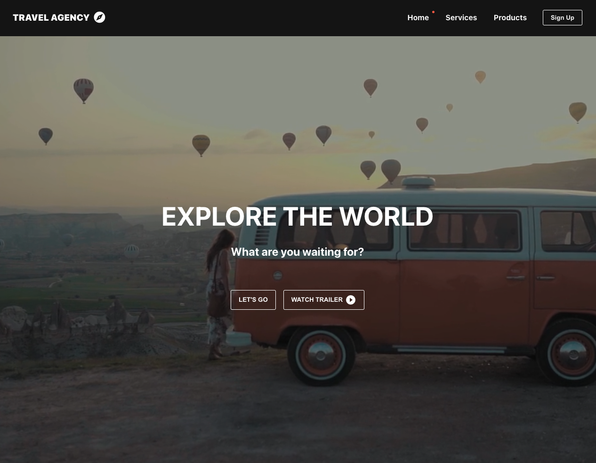

# 2. Travel Agency (React.js)
## Screenshots

## Features
- Navbar
- Hero (video bg)
- Gallery / Travel options
- Footer
- Pages (Mockup)
- Context API - travel products
- Active menu indicator (e.g. red dot)
- Mobile / Responsive

## Skills
- HTML
- CSS
- JS
- React.js
- Context API (React.js)